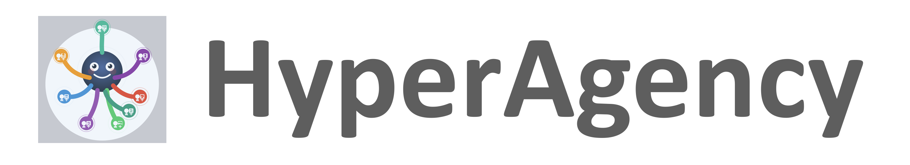

# 🐙 HyperAgency (h9y)




[]


[**HyperAgency**](https://h9y.ai/) is an **open-source agentic AI operating system** for building, orchestrating, and deploying collaborative systems of AI agents and humans. It has self-developing tools for building fully autonomous software companies. The agents can be generated in semi-automatic mode. It includes web3 marketplace for selling and buying hyper agents. The hyper agents can make deals with each other and with people on behalf of their users.

We envision a future where software companies can operate with minimal human intervention — composed of agents that code, plan, manage, and evolve. HyperAgency provides the **framework and infrastructure** to explore and build toward that future.

> 🧠 Think of it as your operating system for autonomous workflows — distributed, flexible, and customizable.

---

## 📢 Pre-Public Release Notice

HyperAgency is currently in a pre-public release phase. The repository you are viewing contains the core project structure along with links to several internal Git submodules. These submodule repositories are presently private while we complete stabilization, security reviews, and licensing preparations.
When the platform officially launches, we will open the source code of all associated submodules under the same multi-license model that governs this main repository (Apache-2.0-NC for non-commercial use, AGPL-3.0 for commercial open-source use, and a Commercial License for closed-source enterprise deployments).
Until then, this repository serves as the central public entry point for documentation, roadmap previews, and integration guidelines.

---

## 🧠 Why HyperAgency?

With HyperAgency, you can:

* ✅ **Create, deploy, and manage agents** — quickly iterate and improve.
* 💬 **Communicate across agents and humans** — all in one unified interface.
* 🧩 **Assemble smart, collaborative AI-human teams** — for coding, design, planning, or operations.
* 🗺️ **Coordinate visually** — with an intuitive Map view.
* 🧪 **Use an interactive playground** — test flows step-by-step in real time.
* 🔀 **Orchestrate conversations** — with multi-agent dialog and memory.
* 🔐 **Stay in control** — enterprise-ready with secure APIs, self-hosting, and customizable source code.
* 🌍 **Scale across distributed nodes** — federated and connectable infrastructure.

> ✨ Build your own autonomous AI-first organization — or enhance your existing one.

While still in active development, HyperAgency already includes many of the core components required to experiment with **autonomous system coordination**.

📘 See the [Docs](https://docs.h9y.ai) for full capabilities, architecture, and usage examples.

---

## 📦 Installation

> You can **self-host HyperAgency locally** in just a few steps —
> or skip the setup entirely and **use our cloud environment** for a faster start.

### 🧰 Prerequisites

To run HyperAgency locally, install the following:

* [Docker](https://www.docker.com/)

---

### ☁️ Prefer Not to Self-Host?

If you don’t want to manage infrastructure yourself, you can request access to our hosted **HyperAgency Cloud**, where everything is pre-configured and ready to use.

👉 [Get Cloud Access](https://h9y.ai/signup)

> The cloud environment is perfect for early testing, team collaboration, or demoing agentic flows without running Docker or Vault locally.

---

### Option A: Simple Install

```bash
mkdir hyperagency
cd hyperagency/

curl -fsSL https://raw.githubusercontent.com/vuics/h9y/refs/heads/main/install.sh | sh

# OPTIONALLY: Generate TLS certificates
./gen-certs.sh

# OPTIONALLY: Setup DNS with /etc/hosts
./setup-hosts.sh
```

Run:
```bash
docker compose up
```

Open [h9y.localhost](https://h9y.localhost) in the browser. To unlock Vault for secure storage of keys, see the section "Initialize Vault" below.

---

### Option B: Install from Repo


#### 📦 1. Clone the Repository with Submodules

```bash
git clone git@github.com:vuics/h9y.git
cd h9y
git submodule update --init --recursive
```

#### ⚙️ 2. Configure .Env Files

Copy and customize `.env` files for the main platform and submodules:
```bash
cp env.example .env && touch .env.api .env.agency
```

#### 🔐 3. Generate TLS Certificates

```bash
./gen-certs.sh
```

On macOS, double-click each `.crt` file in `./certs/` to trust them in **Keychain Access**.

#### 🌐 4. Configure Local DNS (Optionally)

If your domain is `h9y.localhost` or anything on localhost, you may not need to configure the DNS, since the locahost often resolves to `127.0.0.1` automatically.

If your domain name does not resolve, set up `/etc/hosts` entries:
```bash
sudo ./setup-hosts.sh
```

#### 🧱 5. Start the Stack

Use Docker Compose to start all services:

```bash
docker-compose up
```

After you started the stack, you can open in the browser:

| App Name | URL                                                      |
| -------- | -------------------------------------------------------- |
| App      | [h9y.localhost](https://h9y.localhost)                   |
| API      | [api.h9y.localhost](https://api.h9y.localhost)           |
| Vault    | [vault.h9y.localhost](https://vault.h9y.localhost)       |
| Langflow | [langflow.h9y.localhost](https://langflow.h9y.localhost) |
| Nodered  | [nodered.h9y.localhost](https://nodered.h9y.localhost)   |

NOTE: Replace `h9y.localhost` with your `${DOMAIN}`.

### 🔑 Initialize Vault

1. Open [Vault](https://vault.h9y.localhost) (replace `h9y.localhost` with your `${DOMAIN}`), and input:
  • Key shares: `5`
  • Key threshold: `3`
2. Set the env vars with displayed initial root token and the keys in the `.env` file in the format:
  ```bash
  VAULT_TOKEN=(Initial root token)
  VAULT_UNSEAL_KEYS=(Key 1),(Key 2),(Key 3),(Key 4),(Key 5)
  ```
3. Unseal the vault by inputing 3 of the keys, and sing into vault with the initial root token.
4. Enable new engine with type KV (kv-v2) and path `secret`.
5. Restart Docker Compose.
  ```bash
  docker compose down
  docker compose up
  ```
---

### 🛑 Stop the Stack

```bash
docker-compose down
```

---

### 👥 Compose Profiles

HyperAgency ships with **predefined Docker Compose profiles** that let you start small, scale fast, and run *exactly* what you need—no more, no less. Profiles align the platform with your **intent**, from first exploration to a full, production-grade agentic stack.

| Profile Name | Description                                                                                                                  |
| ------------ | ---------------------------------------------------------------------------------------------------------------------------- |
| `try`        | **Minimal, zero‑friction setup** to explore HyperAgency (default). Ideal for first‑time users, quick demos, and experiments. |
| `h9y`        | **Core HyperAgency services** included in the `h9y` repository. Best for active development and local iteration.             |
| `all`        | **Complete HyperAgency Cloud stack**, mirroring the services available at [HyperAgency Cloud](https://h9y.ai).               |

#### ⚙️ Selecting a Profile

Choose the profile that matches your current goal by setting it in the [`.env`](https://github.com/vuics/h9y/blob/main/env.example) file:

```bash
COMPOSE_PROFILES=h9y
```

Then start HyperAgency using Docker Compose as usual. Docker will automatically enable **only** the services associated with the selected profile.

#### 🧩 Mixing Profiles

HyperAgency profiles are **composable by design**. You can enable multiple profiles at the same time and Docker Compose will merge them into a single runtime configuration.

```bash
COMPOSE_PROFILES=try,logs,metrics
```

This allows you to keep a **lean base setup** while selectively adding cross‑cutting capabilities such as observability, integrations, or experimental services.

* ➕ Profiles are **additive** — services are combined, not overridden
* 🔀 Order does not matter — Docker Compose resolves the union automatically
* 🧠 Ideal for power users who want fine‑grained control

You can find the **exhaustive list of available profiles** in the [`docker-compose.yaml`](https://github.com/vuics/h9y/blob/main/docker-compose.yml).

---

## 🎯 Conclusion

**HyperAgency is an evolving framework for building agentic, autonomous systems — and eventually, fully autonomous software companies.**

It already offers powerful capabilities for orchestrating agents, coordinating distributed systems, and integrating LLMs and humans in real-time workflows. By joining early, you can contribute to defining what autonomous organizations of the future look like.

> 🔍 Explore. 🤝 Collaborate. 🚀 Build.
> Start building your own **agentic stack** with [HyperAgency](https://h9y.ai/) today.

---

## 🙏 Acknowledgements

Special thanks to **Hal Casteel** and **William McKinley** for their early ideas, feedback, and discussions. Their insights into intelligent systems and automation inspired much of what became [HyperAgency](https://h9y.ai/).

---

## 📜 Licensing Overview

HyperAgency follows a **clear separation between software licensing and brand ownership**.
This ensures **maximum openness for developers** while **protecting the HyperAgency identity and trust**.

### 🧠 Software (Source Code) Licensing

The **HyperAgency source code** is available under a [**multi-license model**](./LICENSE), allowing you to choose the license that best fits your use case.

| Use Case                                    | License            |
| ------------------------------------------- | ------------------ |
| Personal, educational, non-commercial use   | Apache-2.0-NC      |
| Commercial projects that remain open-source | AGPL-3.0           |
| Commercial closed-source or proprietary use | Commercial License |

#### Choose the license that matches your use:

* [**Apache-2.0-NC**](./LICENSE-Apache-2.0-NC) – Free for personal, educational, and non-commercial usage
* [**AGPL-3.0**](./LICENSE-AGPL-3.0) – Free for commercial use **if modifications remain open-source**
* [**Commercial License**](./LICENSE-COMMERCIAL) – Required for proprietary, closed-source, or SaaS offerings

Answers on the most frequent licensing questions are listed in [Licensing FAQ](./Licensing-FAQ.md).

For commercial licensing inquiries, contact **[artem@h9y.ai](mailto:artem@h9y.ai)**.

### 🛡️ Brand, Name & Logo (Trademark Protection)

The **HyperAgency name, logo, and visual identity are NOT covered by the open-source licenses above**.

They are protected under **trademark law** and governed by the  
➡️  [**HyperAgency Trademark Policy**](./TRADEMARK.md).

This means:

* ✅ You may **use, install, modify, and distribute the code** according to its license
* ❌ You may **NOT use the HyperAgency name or logo** in ways that imply official endorsement, ownership, or affiliation unless explicitly permitted

This separation protects users from confusion while keeping the software ecosystem open and extensible.

> **In short:**
> **Open code encourages innovation. Protected branding ensures trust.**
