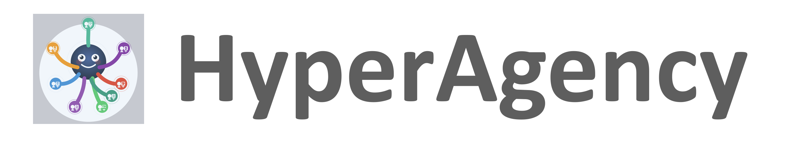
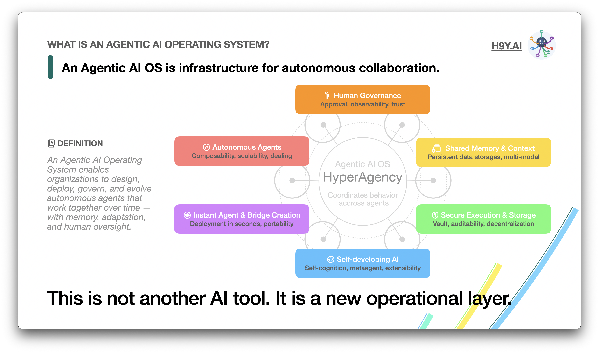
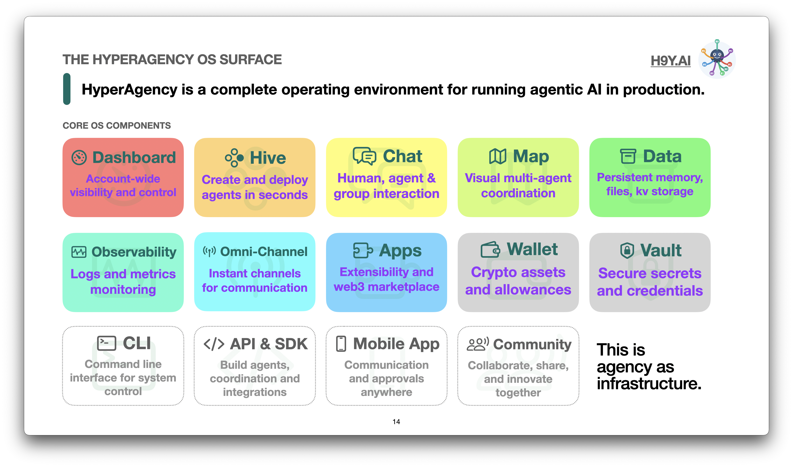
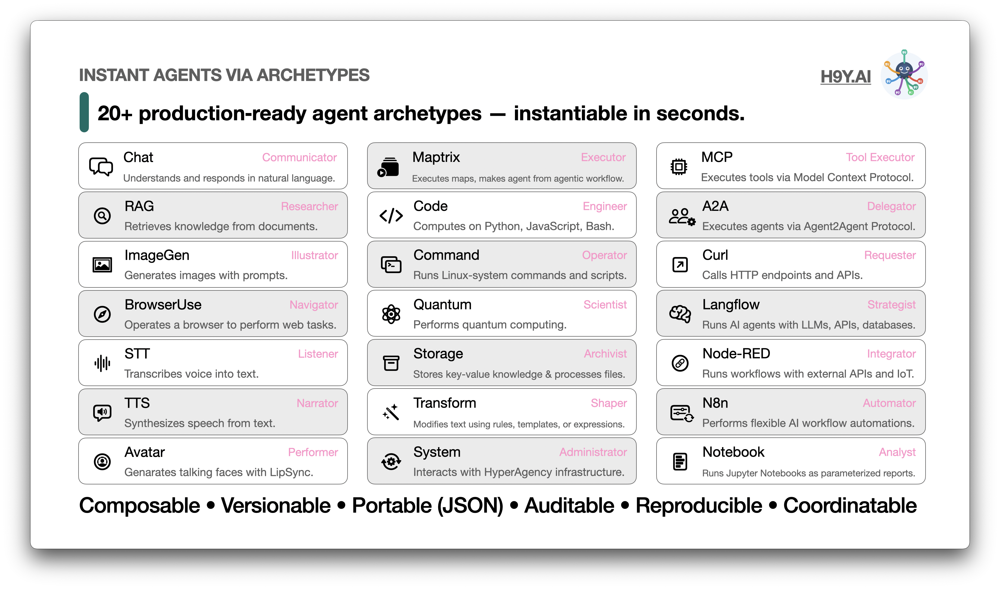
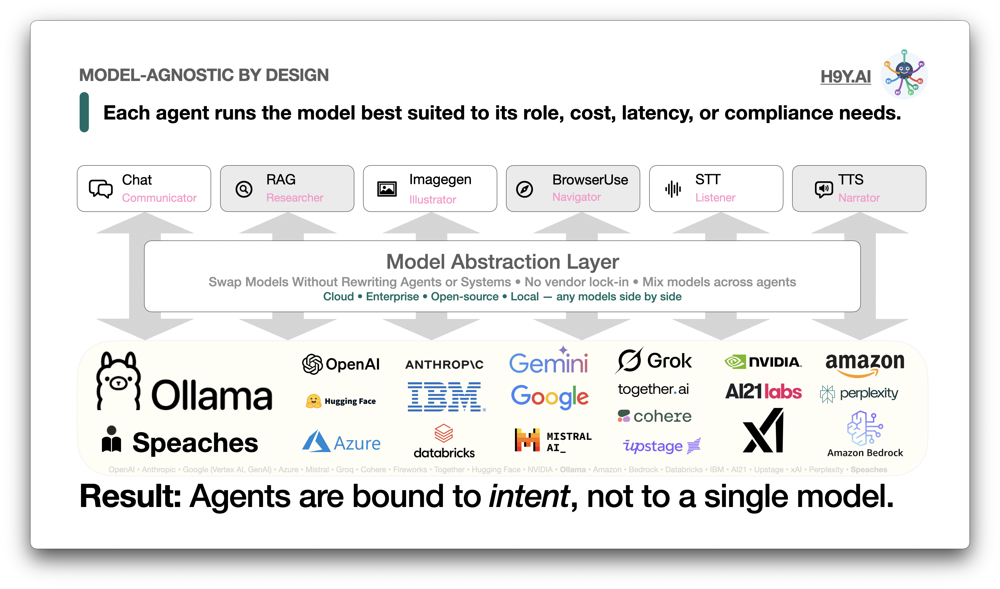
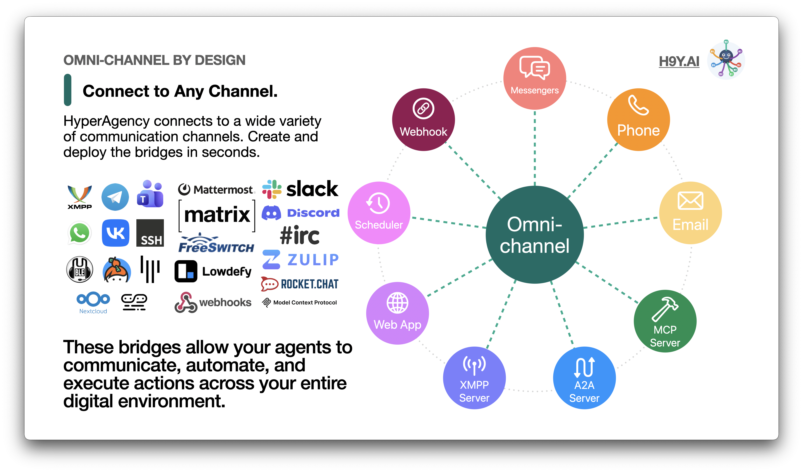
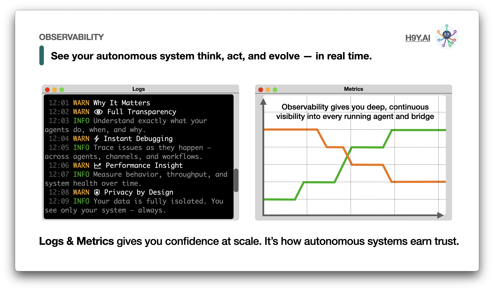
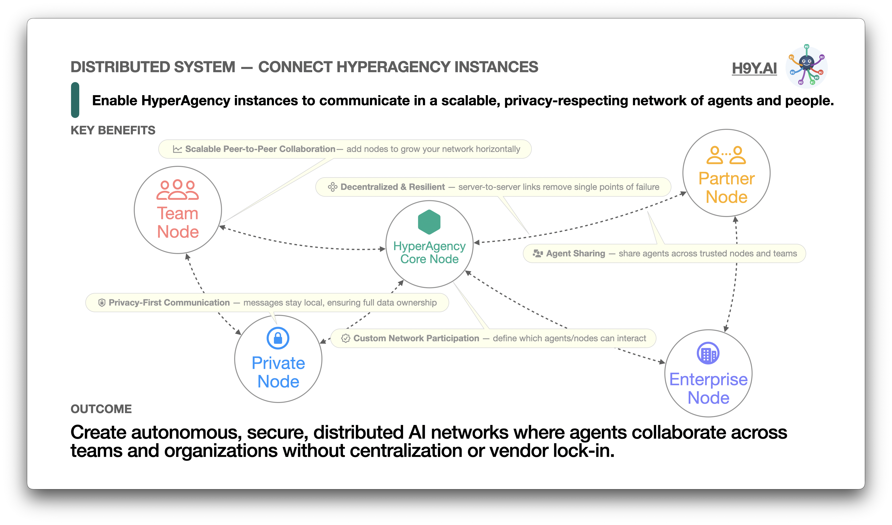
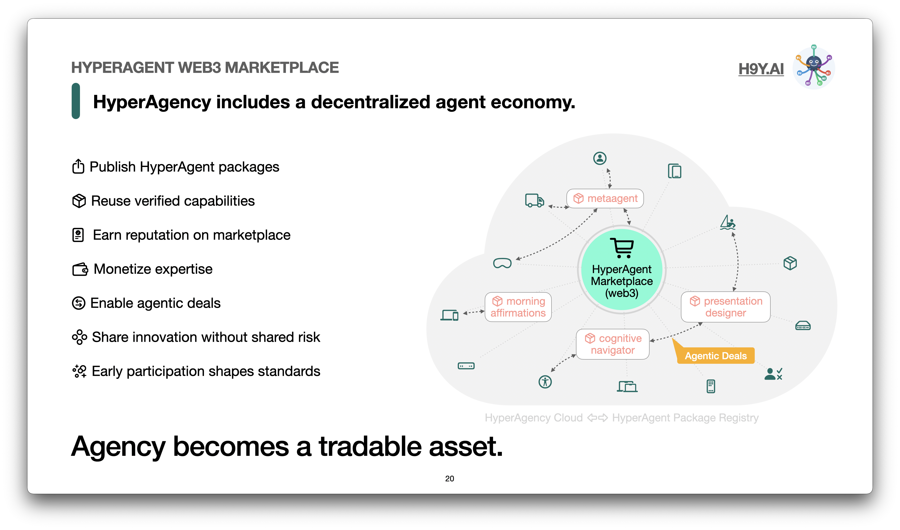
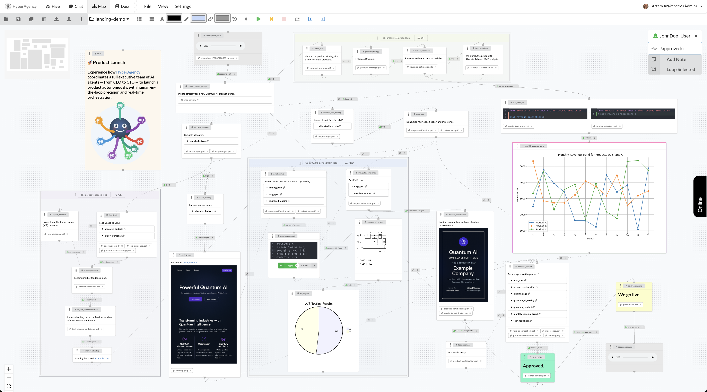

# 🐙 HyperAgency (h9y.ai)



[](https://h9y.ai)
[](https://docs.h9y.ai)
[](https://doi.org/10.13140/RG.2.2.27454.55365)
[](https://github.com/vuics/h9y)
[](https://github.com/vuics/h9y/blob/main/LICENSE)
[](https://forms.gle/bCACFoXj7so4paDg8)

[**HyperAgency**](https://h9y.ai/) is an **Agentic AI Operating System** that replaces brittle, fragile automations with **long-lived, self-improving systems**. HyperAgency allows organizations to deploy autonomous agents that **remember, adapt, and act on your behalf**, under **human governance and auditability**.  

It is **open-source, model-agnostic, and cloud/self-hosted**, providing the infrastructure to build **fully autonomous AI-human organizations**.

> 🧠 Think of HyperAgency as your **operating system for autonomous workflows** — distributed, flexible, and composable.

📘 Explore the [**HyperAgency Documentation**](https://docs.h9y.ai) for full capabilities, architecture, agent archetypes, integration examples, and step-by-step guides.  

📄 Read the [**HyperAgency Research Paper**](https://doi.org/10.13140/RG.2.2.27454.55365) for the system design, implementation and use cases.  

#### 🎬 Watch about HyperAgency on YouTube

[](https://youtu.be/N_uJlCHf77s)

---

## 🚀 What is HyperAgency?

HyperAgency is more than an AI platform — it's a **new operational layer**:

- **Persistent Agency** — agents maintain memory and context across time, adapting to real-world changes.  
- **Coordinated Intelligence** — multiple agents work together to solve complex problems.  
- **Human Governance** — clear approval points, credential management, and auditable behavior.  
- **Omni-Channel Connectivity** — integrate across messengers, web apps, email, and APIs.  
- **Decentralized Architecture** — connect multiple HyperAgency instances for distributed collaboration.  
- **Web3 Marketplace** — publish, buy, and monetize agentic workflows and HyperAgents.  
- **MetaAgent** — self-developing AI that creates, evolves, and orchestrates agents autonomously.

> HyperAgency turns AI from **fragile scripts and prompts** into **living, compound intelligence systems**.



---

## 🌟 Key Features

- ✅ **Create & Deploy Agents** — instant archetypes or custom blueprints.  
- 💬 **Multi-Agent Communication** — human and AI interaction in one interface.  
- 🗺️ **Map View** — visualize workflows and agent coordination.  
- 🧩 **Composable Systems** — agents can orchestrate other agents, integrate APIs, run scripts, generate content, or process data.  
- 🔀 **Persistent Memory** — knowledge, workflow state, and context are shared and versioned.  
- 🔐 **Governance & Security** — Vault-secured credentials, audit logs, approvals.  
- 🌍 **Distributed Nodes** — federated network for scalable collaboration.  
- ⚡ **Rapid Deployment** — cloud or local containerized setup, production-ready.



---

## 🧩 Agent Archetypes

HyperAgency comes with **20+ production-ready agents** you can deploy instantly:

| Archetype                  | Role / Function |
|--------------------------- | ---------------- |
| **Chat**                   | Natural language communication |
| **RAG**                    | Research & document retrieval |
| **ImageGen**               | Image generation from prompts |
| **BrowserUse**             | Web navigation & task automation |
| **Hermes**                 | Autonomous general-purpose agent |
| **OpenClaw**               | Personal AI assistant |
| **Codex**                  | Software engineering agent |
| **ClaudeCode** (connector) | Coding assistant connector |
| **STT**                    | Speech-to-text transcription |
| **TTS**                    | Text-to-speech synthesis |
| **Avatar**                 | Talking faces with lip-sync |
| **Maptrix**                | Nested workflow execution |
| **Code**                   | Python, JavaScript, Bash computation |
| **Command**                | Linux command execution |
| **Quantum**                | Quantum computing tasks |
| **Storage**                | Key-value and file storage |
| **Transform**              | Text transformation & templating |
| **System**                 | HyperAgency infrastructure management |
| **MCP**                    | Tool execution via Model Context Protocol |
| **A2A**                    | Agent-to-agent delegation |
| **Curl**                   | API / HTTP requests |
| **Langflow**               | AI strategy & multi-agent orchestration |
| **Node-RED**               | External API & IoT workflow integration |
| **N8n**                    | Flexible automation workflows |
| **Notebook**               | Parameterized Jupyter notebooks |

> All agents are **composable, versionable, portable (JSON), auditable, and reproducible**.



---

## ⚙️ Model Providers

Each agent can run **any compatible LLM or model** based on role, cost, latency, or compliance:

- **Ollama** (local open-source LLMs)  
- **Speaches** (local open-source TTS/STT models)  
- OpenAI  
- Anthropic  
- Google (Vertex AI / GenAI)  
- Azure  
- Mistral  
- Groq  
- Cohere  
- Fireworks  
- Together  
- Hugging Face  
- NVIDIA  
- Amazon / Bedrock  
- Databricks  
- IBM  
- AI21  
- Upstage  
- xAI  
- Perplexity  

> Agents are bound to intent, not to a single model — **no vendor lock-in**.



---

## 💬 Omni-Channel Integration

Deploy agents across **any communication channel** in seconds:

- Messengers: XMPP, Telegram, Slack, Discord, MS Teams, WhatsApp, VK, Mattermost, Matrix, IRC, Zulip, Rocket Chat, SSH Chat, NextCloud Talk, Muble, Keybase  
- Email: IMAP/SMTP  
- Phone: FreeSwitch  
- Scheduler: Cron
- Webhooks Server  
- A2A Server  
- MCP Server  
- Web App: Lowdefy  
- XMPP Server  

> Bridges let agents **communicate, automate, and act** across your digital ecosystem.



---

## 🧭 Observability

Full visibility into **agent actions, memory, and evolution**:

- Logs & metrics in real-time  
- Debug and trace workflows across agents  
- Performance monitoring and system health  
- Privacy-first design — isolated data per organization  



---

## 🌐 Distributed & Decentralized

HyperAgency supports **secure peer-to-peer networks**:

- Scale horizontally with multiple nodes  
- Share agents across trusted nodes and teams  
- Retain **full control over privacy and data ownership**  



---

## 🏪 Web3 Marketplace

- Publish, share, and monetize **HyperAgent packages**  
- Join a **global ecosystem of builders and innovators**  
- Enable agentic deals with verifiable capabilities  



---

## 📊 Installation Feature Comparison

This section helps you understand what capabilities are available depending on how you install HyperAgency.

We support four deployment modes:

* A. 🧩 **Standalone** (individual) — single all-in-one Docker container for quick start and local testing
* B. 🐳 **Docker Cluster** (team) — multi-service Docker Compose setup for personal or team deployments
* C/D. ☸️  **Kubernetes Cluster** (enterprise) — scalable enterprise-grade infrastructure deployment (on-prem or private-cloud)
* E. ☁️  **HyperAgency Cloud** (any) — fully managed hosted platform at [https://h9y.ai](https://h9y.ai)

---

## 🚀 Feature Matrix (Capabilities by Installation Type)

| Feature       | Standalone | Docker Cluster | Kubernetes Cluster | HyperAgency Cloud |
| ------------- | ---------- | -------------- | ------------------ | ----------------- |
| Web-Landing   | ❌         | ❌             | ✅                 | ✅                |
| Dashboard     | ✅         | ✅             | ✅                 | ✅                |
| Hive          | ✅         | ✅             | ✅                 | ✅                |
| Chat          | ✅         | ✅             | ✅                 | ✅                |
| Map           | ✅         | ✅             | ✅                 | ✅                |
| Data          | ✅         | ✅             | ✅                 | ✅                |
| Observability | ❌         | ✅             | ✅                 | ✅                |
| Omni-channel  | ✅         | ✅             | ✅                 | ✅                |
| Apps          | ✅         | ✅             | ✅                 | ✅                |
| Wallet        | ❌         | ❌             | ✅                 | ✅                |
| Vault         | ❌         | ✅             | ✅                 | ✅                |
| CLI           | ✅         | ✅             | ✅                 | ✅                |
| API & SDK     | ✅         | ✅             | ✅                 | ✅                |
| Mobile App    | ❌         | ❌             | ✅                 | ✅                |

---

## 🤖 Agent Availability Matrix

| Agent       | Standalone | Docker Cluster | Kubernetes Cluster | HyperAgency Cloud |
| ----------- | ---------- | -------------- | ------------------ | ----------------- |
| Chat        | ❌         | ✅             | ✅                 | ✅                |
| RAG         | ❌         | ✅             | ✅                 | ✅                |
| ImageGen    | ✅         | ✅             | ✅                 | ✅                |
| BrowserUse  | ❌         | ✅             | ✅                 | ✅                |
| OpenClaw    | ❌         | ✅             | ✅                 | ✅                |
| Hermes      | ❌         | ✅             | ✅                 | ✅                |
| Codex       | ❌         | ✅             | ✅                 | ✅                |
| Claude Code | ❌         | ❌             | ❌                 | ✅                |
| STT         | ❌         | ✅             | ✅                 | ✅                |
| TTS         | ❌         | ✅             | ✅                 | ✅                |
| Avatar      | ❌         | ✅             | ✅                 | ✅                |
| Maptrix     | ✅         | ✅             | ✅                 | ✅                |
| Code        | ❌         | ✅             | ✅                 | ✅                |
| Command     | ✅         | ✅             | ✅                 | ✅                |
| Quantum     | ❌         | ✅             | ✅                 | ✅                |
| Storage     | ✅         | ✅             | ✅                 | ✅                |
| Transform   | ✅         | ✅             | ✅                 | ✅                |
| System      | ✅         | ✅             | ✅                 | ✅                |
| MCP         | ✅         | ✅             | ✅                 | ✅                |
| A2A         | ✅         | ✅             | ✅                 | ✅                |
| Curl        | ✅         | ✅             | ✅                 | ✅                |
| Langflow    | ❌         | ✅             | ✅                 | ✅                |
| Node-RED    | ❌         | ✅             | ✅                 | ✅                |
| N8n         | ❌         | ✅             | ✅                 | ✅                |
| Notebook    | ❌         | ✅             | ✅                 | ✅                |

---

## 🌉 Bridge Availability Matrix

| Bridge            | Standalone | Docker Cluster | Kubernetes Cluster | HyperAgency Cloud |
| ----------------- | ---------- | -------------- | ------------------ | ----------------- |
| Messengers        | ❌         | ✅             | ✅                 | ✅                |
| Email             | ✅         | ✅             | ✅                 | ✅                |
| Phone             | ❌         | ❌             | ✅                 | ✅                |
| Scheduler         | ✅         | ✅             | ✅                 | ✅                |
| Webhooks Server   | ✅         | ✅             | ✅                 | ✅                |
| A2A Server        | ✅         | ✅             | ✅                 | ✅                |
| MCP Server        | ✅         | ✅             | ✅                 | ✅                |
| Web App (Lowdefy) | ❌         | ✅             | ✅                 | ✅                |
| XMPP Server       | ✅         | ✅             | ✅                 | ✅                |

---

## ☁️ Fastest Start (No Self-Hosting)

If you don’t want to manage infrastructure, just use the hosted version of HyperAgency Cloud (SaaS Self-Serve).

👉 **HyperAgency Cloud (SaaS)**
[https://h9y.ai](https://h9y.ai)

> No Docker, no Kubernetes, no setup — just create an account and start using agents immediately.

---

## 📦 Installation

> You can **self-host HyperAgency locally** in just a few steps —
> or skip the setup entirely and **use our cloud environment** for a faster start.

### 🧰 Prerequisites

To run HyperAgency locally, install the following:

* [Docker](https://www.docker.com/)
* [mkcert](https://github.com/FiloSottile/mkcert)

---

### Option A: Quick Start (Install Standalone)

Quick start:
```bash
docker run \
  --name h9y-standalone \
  -p 3990:3990 -p 6369:6369 -p 6370:6370 -p 5281:5281 \
  -v h9y-api-volume:/opt/data \
  -v h9y-mongo-volume:/data/db \
  -v h9y-prosody-volume:/var/lib/prosody \
  ghcr.io/vuics/h9y:v1.39.0

# Or use latest image:
#   ghcr.io/vuics/h9y:latest
```

Open [localhost:5281](https://localhost:5281/) in the browser. Confirm using untrusted certificate.

Open [localhost:3990](https://localhost:3990/) in the browser and start using standalone h9y.

### Option B: Install Docker Cluster

```bash
mkdir hyperagency
cd hyperagency/

curl -fsSL https://raw.githubusercontent.com/vuics/h9y/refs/heads/main/install.sh | sh

# RECOMMENDED: Generate TLS certificates.
#   (Otherwise, use your own certificates.)
./gen-certs.sh

# OPTIONALLY: Setup DNS with /etc/hosts
./setup-hosts.sh
```

Run:
```bash
docker compose up
```

After you started the stack, you can open in the browser:

| App Name | URL                                                      |
| -------- | -------------------------------------------------------- |
| App      | [h9y.localhost](https://h9y.localhost)                   |
| API      | [api.h9y.localhost](https://api.h9y.localhost)           |
| Vault    | [vault.h9y.localhost](https://vault.h9y.localhost)       |
| Langflow | [langflow.h9y.localhost](https://langflow.h9y.localhost) |
| Nodered  | [nodered.h9y.localhost](https://nodered.h9y.localhost)   |

NOTE: Replace `h9y.localhost` with your `${DOMAIN}`.

#### 🔑 Initialize Vault

1. Open [Vault](https://vault.h9y.localhost) (replace `h9y.localhost` with your `${DOMAIN}`), and input:
  • Key shares: `1`
  • Key threshold: `1`
2. Set the env vars with displayed initial root token and the keys in the `.env` file in the format:
  ```bash
  VAULT_TOKEN=(Initial root token)
  VAULT_UNSEAL_KEYS=(Key 1)
  ```
3. Unseal the vault by inputing the key, and sing into vault with the initial root token.
4. Enable new engine with type KV (kv-v2) and path `secret`.
5. Restart Docker Compose.
  ```bash
  docker compose down
  docker compose up
  ```

#### 🎬 Watch Simple Install Video on YouTube

[](https://youtu.be/VslDuuoJ46c?t=136)

---

### Option C: Kubernetes Cluster (Enterprise Self-Hosted)

> Recommended for enterprise-grade deployments, high availability, and production-scale infrastructure.

Deploy HyperAgency on your own Kubernetes infrastructure using our official Helm chart.

#### What you get:

* Full Kubernetes-native deployment
* Horizontal scaling of agents and services
* Production-grade observability integration
* Secure secrets management (Vault / external KMS)
* Multi-node distributed execution

#### Installation

> 📦 Helm chart and documentation provided upon request.

```bash
# Contact us to receive:
# - Helm chart (private or enterprise repo)
# - Cluster architecture guide
# - Production deployment instructions
```

📩 Request access: [artem@h9y.ai](mailto:artem@h9y.ai)

---

### Option D: Managed Private Cloud (HyperAgency Deployed for You)

> Best for teams who want HyperAgency in production without managing infrastructure.

We deploy and operate a dedicated HyperAgency instance tailored to your environment.

#### What you get:

* Dedicated cloud or hybrid deployment
* Custom configuration and integrations
* Continuous updates and maintenance
* Enterprise SLA (on request)
* Private tenant isolation

#### Includes:

* Custom agents setup
* API integrations
* Observability dashboards
* Optional custom development

📩 Contact us for deployment: [artem@h9y.ai](mailto:artem@h9y.ai)

---

### Option E: HyperAgency Cloud (SaaS Self-Serve)

> Fastest way to start using HyperAgency — no setup required.

Access HyperAgency directly via our hosted platform:

🌐 [https://h9y.ai](https://h9y.ai)

#### What you get:

* Fully managed SaaS version
* Instant onboarding (no Docker / Kubernetes)
* Preconfigured agent ecosystem
* Web dashboard + chat interface
* Regular updates and new features

#### Ideal for:

* Early experimentation
* Product evaluation
* Teams without DevOps resources
* Fast prototyping of agent workflows

👉 Create an account and choose a subscription plan:
[https://h9y.ai/signup](https://h9y.ai/signup)

---

### 👥 Compose Profiles (Docker Cluster Only)

HyperAgency ships with **predefined Docker Compose profiles** that let you start small, scale fast, and run *exactly* what you need—no more, no less. Profiles align the platform with your **intent**, from first exploration to a full, production-grade agentic stack.

| Profile Name | Description                                                                                                                  |
| ------------ | ---------------------------------------------------------------------------------------------------------------------------- |
| `try`        | **Minimal, zero‑friction setup** to explore HyperAgency (default). Ideal for first‑time users, quick demos, and experiments. |
| `h9y`        | **Core HyperAgency services** included in the `h9y` repository. Best for active development and local iteration.             |
| `all`        | **Complete HyperAgency Cloud stack**, mirroring the services available at [HyperAgency Cloud](https://h9y.ai).               |

You can find the **exhaustive list of available profiles** in the [`docker-compose.yaml`](https://github.com/vuics/h9y/blob/main/docker-compose.yml).

#### ⚙️ Selecting a Profile

Choose the profile that matches your current goal by setting it in the [`.env`](https://github.com/vuics/h9y/blob/main/env.example) file:
```bash
COMPOSE_PROFILES=h9y
```

You can enable multiple profiles and Docker Compose will merge them into a single runtime configuration:
```bash
COMPOSE_PROFILES=try,logs,metrics
```

Then start HyperAgency using Docker Compose as usual. Docker will run **only** the services associated with the selected profiles.

---

#### 🎬 Watch Usage Video on YouTube

[](https://youtu.be/96emBUqcJkY?t=579)

---

## 🏗️ Build from Source

### Option 1: Build Standalone from Repo

```bash
git clone git@github.com:vuics/h9y.git
cd h9y
docker-compose -f standalone.yml build
docker-compose -f standalone.yml up
```

Open [localhost:5281](https://localhost:5281/) in the browser. Confirm using untrusted certificate.

Open [localhost:8200](https://localhost:8200) in the browser. To unlock Vault for secure storage of keys, see the section "Initialize Vault" below.

---

### Option 2: Build Docker Cluster from Repo

#### 📦 1. Clone the Repository with Submodules

```bash
git clone git@github.com:vuics/h9y.git
cd h9y
```

#### ⚙️ 2. Configure .Env Files

Copy and customize `.env` files for the main platform and submodules:
```bash
cp env.example .env
```

#### 🔐 3. Generate TLS Certificates

```bash
./gen-certs.sh
```

On macOS, double-click each `.crt` file in `./certs/` to trust them in **Keychain Access**.

#### 🌐 4. Configure Local DNS (Optionally)

If your domain is `h9y.localhost` or anything on localhost, you may not need to configure the DNS, since the locahost often resolves to `127.0.0.1` automatically.

If your domain name does not resolve, set up `/etc/hosts` entries:
```bash
sudo ./setup-hosts.sh
```

#### 🧱 5. Start the Stack

Use Docker Compose to start all services:

```bash
docker-compose up
```

Open [h9y.localhost](https://h9y.localhost) in the browser. To unlock Vault for secure storage of keys, see the section "Initialize Vault" above.

#### 🛑 6. Stop the Stack

```bash
docker-compose down
```

---

## 🧠 Software (Source Code) Licensing

The **HyperAgency source code** is available under a [**multi-license model**](./LICENSE), allowing you to choose the license that best fits your use case.

| Use Case                                                                  | License                                    |
| ------------------------------------------------------------------------- | ------------------------------------------ |
| Free for personal, educational, non-commercial use                        | [Apache-2.0-NC](./LICENSE-Apache-2.0-NC)   |
| Free for commercial projects that remain open-source                      | [AGPL-3.0](./LICENSE-AGPL-3.0)             |
| Required for commercial closed-source, proprietary use, or SaaS offerings | [Commercial License](./LICENSE-COMMERCIAL) |

Answers on the most frequent licensing questions are listed in [Licensing FAQ](./Licensing-FAQ.md).

For commercial licensing inquiries, contact **[artem@h9y.ai](mailto:artem@h9y.ai)**.

⚠️  HyperAgency name and logo are trademarked. See [TRADEMARK.md](./TRADEMARK.md).

---

## 💼 Paid Pilot / Early Access

HyperAgency isn’t just for experimentation — you can run **real production-grade agentic systems** in your environment under **founder-led guidance**.

Our **2–3 week pilot programs** are designed to answer one critical question:

> *Can persistent, governed agents replace fragile AI automations in your organization?*

### 🏁 What You’ll Get

* Live HyperAgency deployment in **cloud or self-hosted environment**
* **1–2 production-grade agentic systems** solving a real operational problem
* Persistent **memory, coordination, and observability** running end-to-end
* Clear **governance points** with human approvals, audit logs, and permissions
* Concrete **go / no-go decision** for scaling agentic AI in your org

### 📅 Pilot Options

| Duration | Scope                                                                 |
| -------- | --------------------------------------------------------------------- |
| 2 Weeks  | Proof of viability with 1 agentic map (1–5 agents)                    |
| 3 Weeks  | Operational readiness with 2 agentic maps (up to 10 agents + bridges) |

> All pilots are **hands-on, production deployments** — not demos or slides.

### 🚀 Apply Now

[**Apply for a Paid Pilot**](https://forms.gle/bCACFoXj7so4paDg8)

> Early participation lets you **shape your autonomous workflows**, get direct collaboration with the HyperAgency team, and **jumpstart your agentic AI adoption**.

---



---

## 🎯 Conclusion

**HyperAgency is an evolving framework for building agentic, autonomous systems — and eventually, fully autonomous software companies.**

It already offers powerful capabilities for orchestrating agents, coordinating distributed systems, and integrating LLMs and humans in real-time workflows. By joining early, you can contribute to defining what autonomous organizations of the future look like.

> 🔍 Explore. 🤝 Collaborate. 🚀 Build.
> Build your **autonomous AI organization** today — from fragile AI to **living, compound intelligence systems**.

## 📞 Contact & Community

* Website: [h9y.ai](https://h9y.ai)
* Email: [artem@h9y.ai](mailto:artem@h9y.ai)
* LinkedIn: [Artem Arakcheev](https://linkedin.com/in/artem-arakcheev)
* Paid Pilot / Early Access: [Apply here](https://forms.gle/bCACFoXj7so4paDg8)

